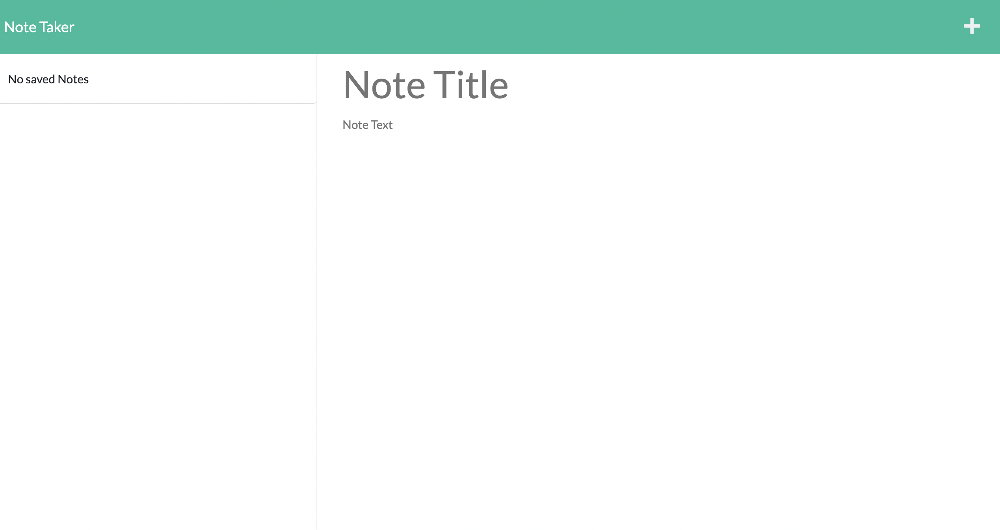

  # Project Title
  Challenge 11 
  
  
  # Description
  This Note Take is used to save notees for the user to reference later on. An example of the displays are shown below:

  
  
  

  Follow this [link](https://github.com/abergtra/challenge-11) for the GitHub repository and this [link](https://salty-thicket-01126.herokuapp.com/) for the live URL.

  # Table of Contents 
  * [Installation](#-Installation)
  * [Usage](#-Usage)
  * [License](#-Installation)
  * [Contributing](#-Contributing)
  * [Tests](#-Tests)
  * [Questions](#-Questions)
      
  # Installation
  Simply visit the deployed live url to begin using the application.
  
  # Usage
  Use this program through the front end deployed application. The user inputs a title and body test for their note. When the save icon shows up, the user can save their new note. The user can click on the notes on the nav bar to view or edit their notes. Users can click the red trash icon to delet their old notes. See the walkthrough here:

  
  
  A video walkthrough is also available if you follow this [link](https://youtu.be/uz6lYwfHEXc).

  # License 
  [License: MIT](https://opensource.org/licenses/MIT) 
    * As this list provided is not comprehensive, if you need another license, contact the author for additional options. 
    
  
  # Contributing 
  Please contact the author about contributing.
  
  # Tests
  There are no tests available for this application.

  # Questions
  * GitHub Username: abergtra
  * Contact Email: asher.bergtraun@gmail.com